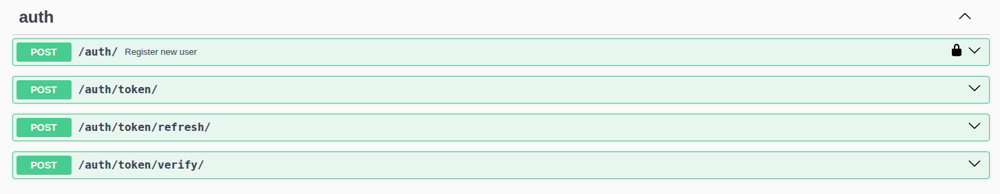
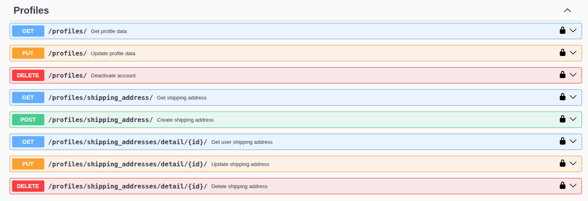
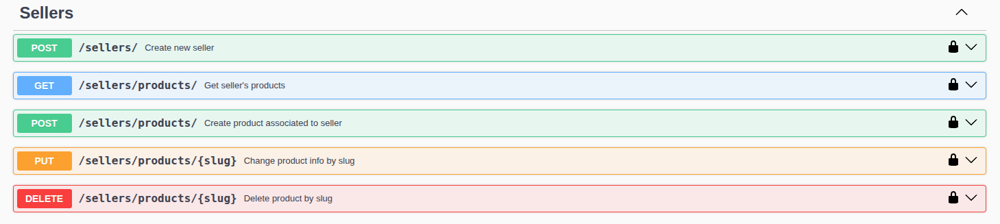
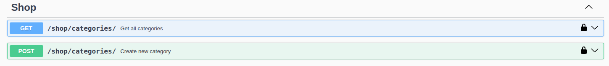

## DRF MarketPlace

### **ВНИМАНИЕ**: конфигурационный файл с секретами не удален по причине того, что этот проект является учебным-CRUD с уклоном в подобие маркетплейса. Будь это проект который выходит в продакшн, конечно бы всё это осталось приватным, но сейчас надобности нет.

### Инструкция по запуску:

Отредактируйте файлы settings.py и docker-compose.yml: смените данные базы данных на свою, либо же оставьте так как есть.

Запустите контейнер с вашей базой данных (по умолчанию PostgreSQL)  
`docker-compose up -d` 

После запуска потребуется установить все миграции из БД:  
`python3 manage.py makemigrations`  
`python3 manage.py migrate`  

Конечно не забываем про установку необходимых зависимостей:  
`pip install -r requirements.txt`  

Далее можно запустить сам веб-сервер:  
`python3 manage.py runserver`  

Веб-сервис будет находиться по адресу: http://localhost:8000/  
SwaggerUI находится по адресу: http://localhost:8000/api/docs  

Чтобы завершить работу сервера нажмите комбинацию клавиш `CTRL+C`  

### Документация по API:

### Auth
Первоначально нужно зарегистрировать вашего нового пользователя/пользователей. Для этого нужно использовать эндпоинт /auth/. Вводите данные для регистрации и получаете HTTP-ответ. При успешном создании пользователя нужно перейти в эндпоинт /auth/token/ и получить JWT access и refresh токены. При надобности в будущем можете использовать обновление токена /auth/token/refresh/. Эндпоинт /auth/token/verify/ существует для проверки токена системой, в ручном использовании надобности нет.

### Profiles
Есть возможность просматривать, редактировать, удалить профиль/личный кабинет своего пользователя с соответсвующими HTTP-запросами к эндпоинту /profiles/. Для просмотра всех адрессов доставки вашего пользователя или добавления новых существуют эндпоинт /profiles/shipping_address/, а при обращении по определенному id адресса можно изменить и удалить адресс доставки.

### Sellers
Продавец - это пользователь, который получил статус проверенного продавца и может иметь товары. Для перехода в статус продавца существует эндпоинт /sellers/. **ВАЖНО**: пользователь будет считаться продавцом ТОЛЬКО ЕСЛИ его атрибут is_approved является True. Программа подразумевает что подтверждение статуса продавца происходит через реального администратора маркетплейса, поэтому вам нужно самим используя базу данных сменить значение на True. Получение всех продуктов продавца или их добавление происходит через эндпоинт /sellers/products/. Для изменения определенного товара или его удаления - эндпоинт /sellers/products/{slug}, где slug - SlugAutoField атрибут объекта. Для любых изменения или удаления любой информации о товарах/продавце пользователь должен являться этим же продавцом. 

### Shop
Особо говорить тут не о чем: добавление категорий или их получение происходит по эндпоинту /shop/categories/. У **каждого** продукта есть атрибут категории.

## Идеи для улучшения

В проекте присутствует информация о статусах товара, его доставке или оплате, но по факу нигде это не используется, так что самым приоритетным улучшением будет создание информации о доставке(псевдо) и оплате(псевдо).